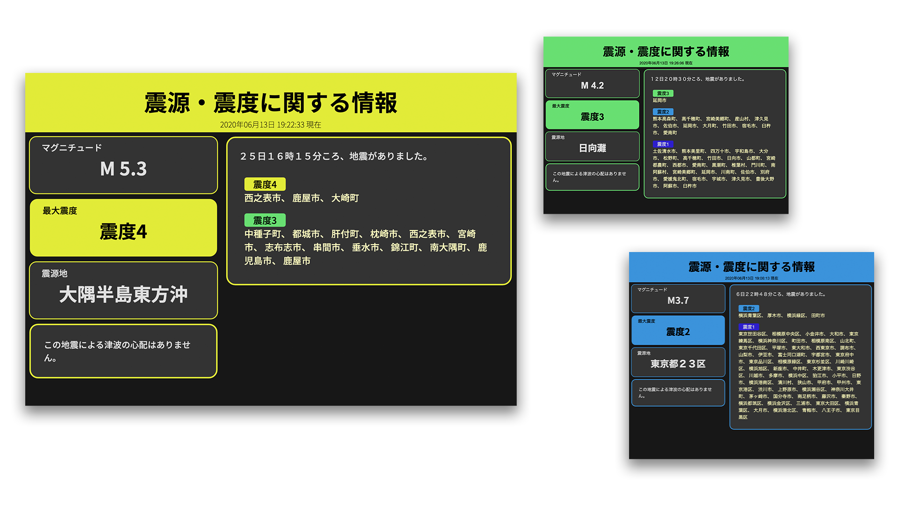

# Template conversion


🇯🇵| [🇺🇸](documents/README_en.md)



## tl;dr

- URLクエリパラメーターに、入力した内容にテンプレートを適用させます。
- Seleniumなどで画面キャプチャをすると簡単に画像として保存できます。

## 💻使い方

- Docker, docker-composeがインストールされていることが前提です。

```bash
docker-compose up -d
```

デフォルトURL: `http://localhost:5000/template`\
震度速報（震源・マグニチュードなし）: `http://localhost:5000/report`

### 📒クエリパラメーターの説明

例: `http://localhost:5000/template?ti=震源・震度に関する情報&areas={'震度４': ['松島市'],'震度３':['一関市', '仙台宮城野区', '若林区', '仙台泉区', '石巻市', '白石市', '名取市', '角田市', '岩沼市', '登米市']}&exp=['１８日１２時００分ころ、地震がありました。', 'この地震による津波の心配はありません。']&max_si=4&epi=宮城県沖&mag=5.2`


- `ti`
  - タイトル。緊急地震速報や地震速報など。
- `areas`
  - 地震の発生エリア。画像では緑のところ。
  - `Dict[str, List[str]]`で記述。

    ```json
    {
        "震度~": [
            "エリア1",
            "エリア2",
            "エリア3",
            ...
        ],
        "震度~": [
            "エリア4",
            "エリア5",
            "エリア6",
            "エリア7",
            "エリア8",
            ...
        ]
        ...
    }
    ```

- `exp`
  - 説明。2つ以上必要です。
  - 最初の1つ目は右のトップに表示されます。
  - 2個目以上は左側に、要素別にBoxで表示されます。

    ```json
    [
        "説明",
        "説明2",
        ...
    ]
    ```

- `max_si`
  - 最大震度
  - `0, 1, 2, 3, 4, 5弱, 5強, 6弱, 6強, 7`が適用されます。（数字の全角可）
  - 最大震度により背景色が変わりますが、正しくない震度が入力された場合は以下のようになります。
    
- `epi`
  - 震源地
- `mag`
  - マグニチュード

### 🎨震度色

| 震度  |                                    色                                     |
| :---: | :-----------------------------------------------------------------------: |
|   0   |  `#d9d9d9` |
|   1   |  `#54cfe8` |
|   2   |  `#64e375` |
|   3   |  `#f0ed4d` |
|   4   |  `#eb9423` |
|  5-   |  `#f74d4d` |
|  5+   |  `#f74d4d` |
|  6-   |  `#f03eb8` |
|  6+   |  `#f03eb8` |
|   7   |  `#b347ed` |
| None  |  `#000000` |

### ⚖ライセンス

[MIT ライセンス](LICENSE)上で公開しています。
