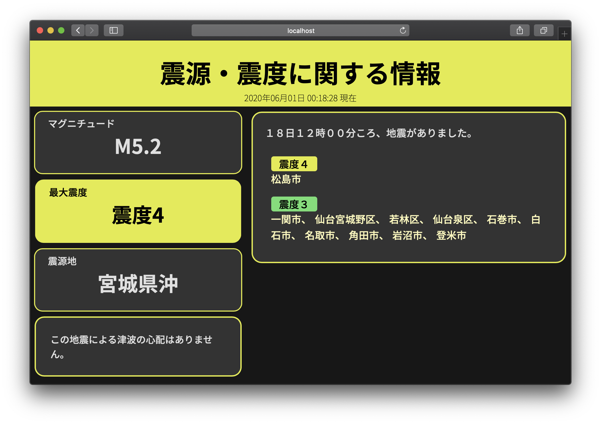

# Template conversion


[🇯🇵](../README.md)| 🇺🇸


## tl;dr

- Let the URL query parameter apply the template to what you have entered.
- You can easily save a screen capture as an image using Selenium, for example.

## 💻Usage

1. Installing dependencies
   - You need to have python3 and pip installed.

    ```bash
    # Installing pipenv using pip
    pip install pipenv

    # Install on pipenv virtual environment & launch a virtual environment
    pipenv install
    pipenv shell

    # Or install it on your system (you can manipulate the library with pip)
    pipenv install --system --deploy
    ```

2. Run

    ```bash
    python src/main.py
    ```

default URL: `http://localhost:5000/template`\
Preliminary seismic intensity report (no epicenter or magnitude): `http://localhost:5000/report`

### 📒Explanation of query parameters

For example: `http://localhost:5000/template?ti=震源・震度に関する情報&areas={'震度４': ['松島市'],'震度３':['一関市', '仙台宮城野区', '若林区', '仙台泉区', '石巻市', '白石市', '名取市', '角田市', '岩沼市', '登米市']}&exp=['１８日１２時００分ころ、地震がありました。', 'この地震による津波の心配はありません。']&max_si=4&epi=宮城県沖&mag=5.2`



- `ti`
  - Title. Emergency and earthquake alerts.
- `areas`
  - The area where the earthquake occurred. In the image, the green area.
  - Described in `Dict[str, List[str]]`.

    ```json
    {
        "Seismic intensity.": [
            "area 1",
            "area 2",
            "area 3",
            ...
        ],
        "Seismic intensity.": [
            "area 4",
            "area 5",
            "area 6",
            "area 7",
            "area 8",
            ...
        ]
        ...
    }
    ```

- `exp`
  - Description. 2 or more required.
  - The first one appears at the top right.
  - The second one and more are displayed in a box on the left side, by element.

    ```json
    [
        "Description",
        "Description 2",
        ...
    ]
    ```

- `max_si`
  - maximum seismic intensity
  - `0, 1, 2, 3, 4, 5弱, 5強, 6弱, 6強, 7`(Full-size numbers are allowed.)
  - The background color changes according to the maximum intensity, but if an incorrect intensity is entered, it will look like this
    
- `epi`
  - epicenter
- `mag`
  - magnitude

### 🎨seismic colour (color)

| seismic intensity |                                   color                                   |
| :---------------: | :-----------------------------------------------------------------------: |
|         0         |  `#d9d9d9` |
|         1         |  `#2d1fcc` |
|         2         |  `#3b93db` |
|         3         |  `#67e071` |
|         4         |  `#e2eb38` |
|        5-         |  `#e38227` |
|        5+         |  `#e38227` |
|        6-         |  `#e81c2d` |
|        6+         |  `#e81c2d` |
|         7         |  `#e81c2d` |
|       None        |  `#000000` |

### ⚖license

It is released under the [MIT license](../LICENSE).
