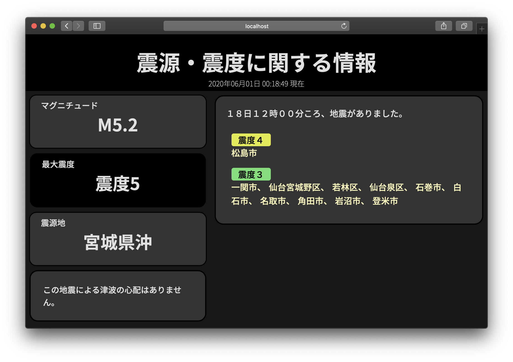

# template-conversion

🇯🇵| [🇺🇸](documents/README_en.md)


## tl;dr

- URLクエリパラメータに入力した内容にテンプレートを適用させます。
- Seleniumなどで画面キャプチャをすると簡単に画像として保存できます。

## 使い方

1. 依存関係のインストール
   python3、およびpipがインストールされていることが前提です。

    ```bash
    # pipを使用してpipenvをインストールする
    pip install pipenv

    # case.1 pipenvの仮想環境上にインストールする & 仮想環境を立ち上げる
    pipenv install
    pipenv shell

    # システム上にインストールする（pipでライブラリを操作可）
    pipenv install --system --deploy
    ```

2. 起動する

```bash
python src/main.py
```

デフォルトURL: `http://localhost:5000/template`

### クエリパラメータの説明

例: `http://localhost:5000/template?ti=地震速報&areas={'震度5弱':['茨城県', '埼玉県'], '震度4': ['東京都', '千葉県', '群馬県']}&exp=['午後12時頃強い地震がありました。震度３以上を観測された地域をお知らせします。', 'この地震による津波の心配はありません。']&max_si=５弱&epi=茨城県南部&mag=5.4`


- `ti`
  - タイトル。緊急地震速報や地震速報など。
- `areas`
  - 地震の発生エリア。画像では緑のところ。
  - `Dict[str, List[str]]`で記述。

    ```json
    {
        "震度~": [
            "エリア1",
            "エリア2",
            "エリア3",
            ...
        ],
        "震度~": [
            "エリア4",
            "エリア5",
            "エリア6",
            "エリア7",
            "エリア8",
            ...
        ]
        ...
    }
    ```

- `exp`
  - 説明。2つ必要です。3つ以上追加されている場合は先頭から2つしか適用されません。

    ```json
    [
        "説明",
        "説明2"
    ]
    ```

- `max_si`
  - 最大震度
  - `0, 1, 2, 3, 4, 5弱, 5強, 6弱, 6強, 7`が適用されます。（数字の全角可）
  - 最大震度により背景色が変わりますが、正しくない震度が入力された場合は以下のようになります。
    
- `epi`
  - 震源地
- `mag`
  - マグニチュード
